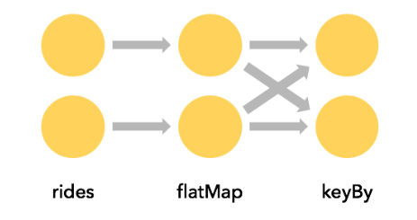

# Data Pipelines and ETL
One very common use case for Apache Flink is to implement ETL (Extract, Transform, Load) pipelines that take data from one or more sources, perform some transformations and/or enrichments, and then store the results somewhere. 

## Stateless Transformations
This section covers `map()` and `flatmap()`, the basic operations used to implement stateless transformations. The examples in this section assume familiarity with the Taxi Ride data used in the hands-on exercises in the [flink-training repo](https://github.com/apache/flink-training/tree/release-1.15/)

### map()
In the first exercise, you filtered a stream of taxi ride events. In that same code base there is a `GeoUtils` class that provides a static method `GeoUtils.mapTGridCell(float lon, float lat)` which maps a location (longitide, latitude) to a grid cell that refers to an area that is approximately 100 x 100 metres in size.

Now let's enrich our stream of taxi ride objects by adding `startCell` and `endCell` fields to each event. You can create and `EnrichedRide` object that extends `TaxiRide`, adding these fields:

```java
public static class EnrichedRide extends TaxiRide {
    public int startCell;
    public int endCell;

    public EnrichedRide() {}

    public EnrichedRide(TaxiRide ride) {
        this.rideId = ride.rideId;
        this.isStart = ride.isStart;
        ...
        this.startCell = GeoUtils.mapToGridCell(ride.startLon, ride.startLat);
        this.endCell = GeoUtils.mapToGridCell(ride.endLon, ride.endLat);
    }

    public String toString() {
        return super.toString() + "," +
            Integer.toString(this.startCell) + "," +
            Integer.toString(this.endCell);
    }
}
```

You can then create an application that transforms the stream

```java
DataStream<TaxiRide> rides = env.addSource(new TaxiRideSource(...));

DataStrean<EnrichedRide> enrichedNYCRides = rides
.filter(new RideCleansingSolution.NYCFilter())
.map(new Enrichment);

enrichedNYCRides.print();
```

With this `mapFunction`:

```java
public static class Enrichment implements MapFunction<TaxiRide, EnrichedRide> {

    @Override
    public EnrichedRide map(TaxiRide taxiRide) throws Exception {
        return new EnrichedRide(taxiRide);
    }
}
```

### flatmap()

A `MapFunction` is suitable only when perfoeming a one-to-one transformation for each and every stream element coming in, `map()` will emit one transformed element, otherwise you  want to use `flatMap()`

```java
DataStream<TaxiRide> rides = env.addSource(new TaxiRideSource(...));

DataStream<EnrichedRide> enrichedNYCRides = rides
    .flatMap(new NYCEnrichment());

enrichedNYCRides.print();
```

together with a `FlatMapFunction`:

```java
public static class NYCEnrichment implements FlatMapFunction<TaxiRide, EnrichedRide> {

    @Override
    public void flatMap(TaxiRide taxiRide, Collector<EnrichedRide> out) throws Exception {
        FilterFunction<TaxiRide> valid = new RideCleansing.NYCFilter();
        if (valid.filter(taxiRide)) {
            out.collect(new EnrichedRide(taxiRide));
        }
    }
}
```

With the `Collector` provided in this interface, the `flatmap()` method can emit as many stream elements as you like, including none at all.

## Keyed Streams
### keyBy()
It's often very useful to be able to partition a stream around one of its attributes, so that all events with the same value of that attribute are grouped together. For example, suppose you wanted to find the longest taxi rides starting in each of the grid cells. Thinking in terms of a SQL query, this would mean doing some sort of GROUP BY with the `startCell`, while in Flink this is done with `keyBy(keySelector)`

```java
rides
    .flatmap(new NYCEnrichment())
    .keyBy(enrichedRide -> enrichedRide.startCell);
```

Every `keyBy` causes a network shuffle that repartitions the stream. In general this is pretty expensive, since it involves network communication along with serailisation and deserialisation.



### Keys are computed
KeySelectors aren't limited to extracting a key from your events. They can instead, compute the key in whatever way you want, so long as the resulting key is deterministic, and has valid implementations of `hashCode()` and `equals()`. This restriction rules out KeySelectors that generate random numbers or that return Arrays or Enums, but you can have composite keys using Tuples or POJOs, for example, so long as their elements follow these same rules.

The keys must be produced in a deterministic way, because they are recomputed whenever they are needed, rather than being attached to the stream records.

For example, rather than creating a new `EnrichedRide` class with a `startCell` field that we can use as a key via

```java
keyBy(enrichedRide -> enrichedRide.startCell)
```

we could do this instead

```java
keyBy(ride -> GeoUtils.mapTpGridCell(ride.startLon, ride.startLat));
```

### Aggregations on Keyed Streams
This bit of code creates a new stream of tuples containing the `startCell` and duration (in minutes) for each end-of-ride event:
```java
import org.joda.time.Interval;

DataStream<Tuple2<Integer, Minutes>> minutesByStartCell = enrichedNYCRides
    .flatMap(new FlatMapFunction<EnrichedRide, Tuple2<Integer, Minutes>>() {

        @Override
        public void flatMap(EnrichedRide ride,
                            Collector<Tuple2<Integer, Minutes>> out) throws Exception {
            if (!ride.isStart) {
                Interval rideInterval = new Interval(ride.startTime, ride.endTime);
                Minutes duration = rideInterval.toDuration().toStandardMinutes();
                out.collect(new Tuple2<>(ride.startCell, duration));
            }
        }
    });
```

Now it is possible to produce a stream that contains only those rides that are the longest rides ever seen (to that point) for each `startCell`.

There are a variety of ways that the field to use as the key can be expressed. Earlier you saw an example with an `EnrichedRide` POJO where the field to use as the key was specified with its name. This case involves Tuple2 objects, and the index within the tuple (starting from 0) is used to specify the key.

```java
minutesByStartCell
    .keyBy(value -> value.f0) // .keyBy(value -> value.startCell)
    .maxBy(1) // duration
    .print()
```

The output stream now contains a record for each key every time the duration reaches a new maximum - as shown here with cell 50797:

```bash
...
4> (64549,5M)
4> (46298,18M)
1> (51549,14M)
1> (53043,13M)
1> (56031,22M)
1> (50797,6M)
...
1> (50797,8M)
...
1> (50797,11M)
...
1> (50797,12M)
```

### (Implicit) State
Though the state is being handled transparently, Flink has to keep track of the maximum duration of each distinct key.

Whenever state gets involved in your application, you should think about how large the state might become. Whenever the key space is unbounded, then so is the amount of state Flink will need.

When working with streams, it generally makes more sense to think in terms of aggregations over finite windows, rather than over the entire stream.

### `reduce()` and other aggregators
`maxBy()` used above, is just on example of a number of aggregator functions available on Flink's `KeyedStreams`. There is also a more general purpose `reduce()` function that you can use to implement your own custom aggregations.

## Stateful Transformations
### Why is Flink Involved in Managing State?
Your applications are certainly capable of of using state without getting Flink involved in managing it - but Flink offers some compelling features for the state it manages:

* **local**: Flink state is kept local to the machine that processes it, and can be accessed at memory speed
* **durable**: Flink state is fault-tolerant, i.e. it is automatically checkpointed at regular intervals, and is restored upon failure
* **vertically scalable**: Flink state can be kept in embedded RocksDB instances that scale by adding more local disk
* **horizontally scalable**: Flink state is redistributed as your cluster grows and shrinks
* **queryable**: Flink state can be queried externally via the Queryable State API

### Rich Functions
At this point, you have already seen several of Flink's function interfaces, including `FilterFunction`, `MapFunction` and `FlatMapFunction`. These are are all examples of the Single Abstract Method Pattern.

For each of these interfaces, Flink also provides a "rich" variant, e.g. `RichFlatMapFunction` which has some additional methods, including: 

* `open(Configuration config)`
* `close()`
* `getRuntimeContext()`

`open()` is called once, during operator initialisation. This is an opportunity to load some static data, or to open a connection to an external service, for example. 

`getRuntimeContext()` provides access to a whole suite of potentially interesting things, but most notably it is how you can create and access state managed by Flink.

### An Example with Keyed State
In this example, Imagine you have a stream of events that you want to de-duplicate, so that you only keep the first event with each key. Here's an application that does that, using a `RichFlatMapFunction` called a `Deduplicator`

```java
private static class Event  {
    public final String key;
    public final long timestamp;
    ...
}

public static void main(String[] args) throws Exception {
    StreamExecutionEnvironment env = StreamExecutionEnvironment.getExecutionEnvironment();

    env.addSource(new EventSource())
        .keyBy(e -> e.key)
        .flatMap(new Deduplicator())
        .print()

    env.execute();
}
```

To accomplish this, `Deduplicator` will need to somehow remember, for each key, whether or not there has already been an event for that key. It will do so using Flink's _keyed state_ interface.

When you are working with a keyed stream like this one, Flink will maintain a key/value store for each item of state being managed.

Flink supports several different types of keyed state, and this example uses the simplest one, namely `ValueState`. This means that for each key, Flink will store a single object - in this case, an object of type `Boolean`.

Our `Deduplicator` class has two methods: `open()` and `flatMap()`. The open method establishes the use of managed state by defining a `ValueStateDescriptor<Boolean>`. The arguments to the constructor specify a name for this item of keyed state ("hasKeyBeenSeen"), and provide information that can be used to serialise these objects (in this case, `Types.BOOLEAN`).

```java
public static class Deduplicator extends RichFlatMapFunction<Event, Event>  {
    ValueState<Boolean> keyHasBeenSeen;

    @Override
    public void open(Configuration config)  {
        ValueStateDescriptor<Boolean> desc = new ValueStateDescriptor<>("KeyHasBeenSeen", Types.BOOLEAN);
        keyHasBeenSeen = getRuntimeContext().getState(desc);
    }

    @Override
    public void flatMap(Event event, Collector<Event> out) throws Exception {
        if (keyHasBeenSeen.value() == null) {
            out.collect(event);
            keyHasBeenSeen.update(true);
        }
    }
}
```

When the `flatMap` method calls `keyHasBeenSeen.value()`, Flink's runtime looks up the value of this piece of state for the _key in context_, and only if it is `null` does it go ahead and collect the event to the output. It also updates `keyHasBeenSeen` to `true` in this case.

This mechanism for accessing and updating key-partitioned state may seem rather magical, since the key is not explicitly visible in the implementation of our `Deduplicator`. When Flink's runtime calls the `open` method of our `RichFlatMapFunction`, there is no event, and thus no key in comtext at that moment. But when it calls the `flatMap` method, the key for the event being processed is available to the runtime, and is used behind the scenes to determine which entry in Flink's state backend is being operated on.

When deployed to a distributed cluster, there will be many instances of this `Deduplicator` each of which will be responsible for a disjoint subset of the entire keyspace. Thus, when you see a single item of `ValueState` such as

```java
ValueState<Boolean> keyHasBeenSeen;
```
understand that this represents not just a single Boolean, but rather a distributed, sharded, key/value store.


