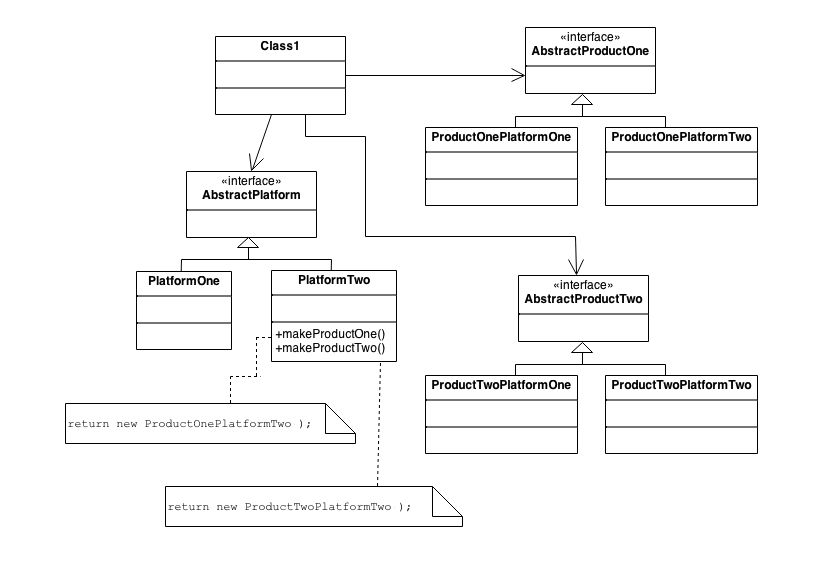
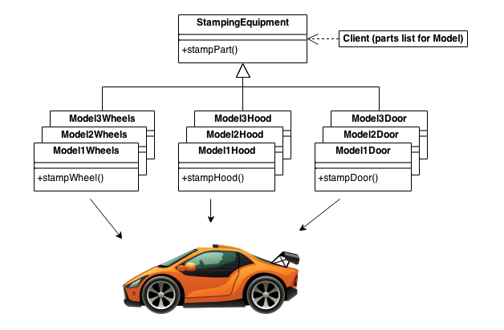

# Abstract Factory Design Pattern

## The Intent
* Provide an interface for creating families of related or dependent objects without specifying their concrete classes.
* A hierarchy that encapsulates: many possible "platforms", and the construction of a suite of "products"
* The `new` operator is considered harmful

## Problem
If an application is to be portable, it needs to encapsulate platform dependencies. These "platforms" might include: windowing system, operating system, database etc. Too often, this encapsulation is not engineered in advance, and lots of `#ifdef` case statements with options for all currently supported platforms begin to procreate like rabbits throughout the code.

## Discussion
Provide a level of indirection that abstracts the creation of families of related or dependent objects without directly specifying their concrete classes. The "Factory" object has the responsibility for providing creation services for the entire platform family. Clients never create platform objects directly, they ask the factory to do that for them.

This mechanism makes exchanging product families easy because the specific class of the factory object appears only once in the application - where it was instantiated. The application can wholesale replace the entire family of products simply by instantiating a different concrete instance of the abstract factory.

Because the service provided by the factory object is so pervasive, it is routinely implemented as a Singleton.

## Structure
The Abstract Factory defines a Factory Method per product. Each Factory Method encapsulates the `new` operator and the concrete, platform-specific, product classes. Each "platform" is then modeled with a Factory-derived class.

## Example
The purpose of the Abstract Factory is to provide an interface for creating families of related objects, without specifying concrete classes. This pattern is found in the sheet metal stamping equipment used in the manufacture of Japanese automobiles. The stamping equipment is an Abstract Factory which creates auto body parts. The same machinery is used to stamp right-hand doors, left-hand doors, right-front fenders, left-front fenders, hoods etc for different models of cars. Through the use of rollers to change the stamping dies, the concrete classes produced by the machinery can be changed within three minutes.

## Checklist

1. Decide if "Platform Independence" and creation services are the current source of pain
2. Map out a matrix of "platforms" vs "problems"
3. Define a factory interface that consists of a factory method per product
4. Define a factory derived class for each platform that encapsulates all references to the `new` operator
5. The client should retire all references to `new` and use the factory methods to create the product objects

## Rules of Thumb

Sometimes creational patterns are competitors: There are cases when either `Prototype` or `Abstract Factory` could be used profitably. At other times, they are complimentary: `Abstract Factory` might store a set of `Prototypes` from which to clone and return product objects, `Builder` can use one of the other patterns to implement which components get built. `Abstract Factory`, `Builder` and `Prototype` can all use `Singleton` in their implementation.

`Abstract Factory`, `Builder` and `Prototype` define a factory object that's responsible for knowing and creating the class of product objects, and make it the parameter of the system. `Abstract Factory` has the factory object producing objects of several classes. `Builder` has the factory object building a complex product incrementally using a correspondingly complex protocol. Prototype has the factory object (aka prototype) building a product by copying a prototype object.

Abstract Factory classes are often implemented with Factory Methods, but they can also be implemented using Prototype

Abstract Factory can be used as an alternative to Facade to hide platform-specific classes.

Builder focuses on constructing a complex object step by step. Abstract Factory emphasizes a family of product objects (either simple or complex). Builder returns the product as a final step, but as far as the Abstract Factory is concerned, the product gets returned immediately.

Often, designs start out using Factory Method (less complicated, mor customizable, subclasses proliferate) and evolve toward AbstractFactory, Prototype or Builder (more flexible, but more complex) as the designer discovers where more flexibility is needed.

