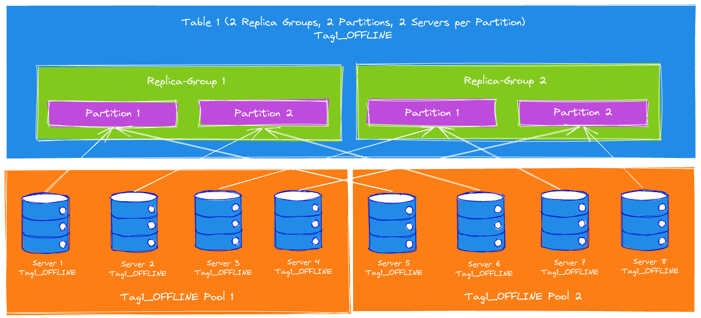

# Pinot Instance Assignment

Instance Assignment is the strategy of assigning servers to host a table. each instance assignment strategy is associated with one segment assignment strategy.

Instance assignment is configured via the **instanceAssignmentConfig**. Based on the config, Pinot can assign servers to a table, then assign segments to servers using the segment assignment strategy associated with the instance assignment strategy.

There are 3 types of instances for the InstanceAssignmentConfig: `OFFLINE`, `CONSUMING`, and `COMPLETED`. `OFFLINE` represents the instances hosting the segments for the offline table; `CONSUMING` represents the instances hosting the consuming segments for the real-time table; `COMPLETED` represents the instances hosting the completed segments for the real-time table. For real-time tables, if `COMPLETED` instances are not configured, completed segments will use the same instance assignment strategy as the consuming segments. If it is configured, completed segments will be automtically moved to the `COMPLETED` instances periodically.

## Default instance assignment

The default instance assignment strategy simply assigns all the servers in the cluster to each table, and uses the Balanced Segment Assignment for the table. This strategy requires no extra configurations for the cluster, and it works well for small clusters with a few tables where all resources can be shared among the tables.

[DIAGRAM GOES HERE]

## Tag-Based instance assignment
For performance-critical use-cases, we might not want to share the server resources for multiple use-cases to prevent the use-case being impacted by other use-cases hosted on the same set of servers. We can use Tag-based Instance Assignment to achiveve this isolation for tables.

In order to use Tag-based Instance Assignment, the servers should be tagged via the Helix, **Instance Config**, where the tag suffix (`_OFFLINE` or `_REALTIME`) denotes the type of table the Pinot Server is going to serve. Each server can have multiple tags if necessary.

After configuring the server tags, the Tag-based instance assignment can be enabled by setting the `tag` within the `instanceAssignmentConfig` for the table shown below. Only the servers with this tag will be assigned to host this table, and the table will use the Balanced Segment Assignment.

[DIAGRAM GOES HERE]

```json
Helix InstanceConfig for Server 1:
{
  "listFields": {
    "TAG_LIST": [
      "Tag1_OFFLINE"
    ]
  },
  ...
}
```

```json
TableConfig for Table 1:
{
  "instanceAssignmentConfigMap": {
    "OFFLINE": {
      "tagPoolConfig": {
        "tag": "Tag1_OFFLINE"
      },
      "replicaGroupPartitionConfig": {
      }
    }
  },
  ...
}
```

## Controlling the Number of Instances
On top of the Tag-Based instance assignment, we can also control the number of servers assigned to each table by configuring the `numInstances` in the `instanceAssignmentConfig`. This is useful when we want to serve multiple tables of the different sizes on the same set of servers. For example, suppose we have 30 servers hosting hundreds of tables for different analytics, we don't want to use all 30 servers for each table, esepcially the tiny tables with only a few MB of data.

[DIAGRAM]

```json
TableConfig for Table 1:
{
  "instanceAssignmentConfigMap": {
    "OFFLINE": {
      "tagPoolConfig": {
        "tag": "Tag1_OFFLINE"
      },
      "replicaGroupPartitionConfig": {
        "numInstances": 2
      }
    }
  },
  ...
}
```

## Replica-Group instance assignment
In order to use the Replica-Group Segment Assignment, the servers need to be assigned to multiple replica-groups of the table, where the Replica-Group Instance Assignment comes into the picture. Enable it anf configure the `numReplicaGroups` and `numInstancesPerReplicaGroup` in the `instanceAssignmentConfig` and Pinot will assign the instances accordingly.

[DIAGRAM]

```json
TableConfig for Table 1:
{
  "instanceAssignmentConfigMap": {
    "OFFLINE": {
      "tagPoolConfig": {
        "tag": "Tag1_OFFLINE"
      },
      "replicaGroupPartitionConfig": {
        "replicaGroupBased": true,
        "numReplicaGroups": 2,
        "numInstancesPerReplicaGroup": 3
      }
    }
  },
  ...
}
```

## Partitioned Replica-Group Instance Assignment
Similar to Replica-Group Segment Assignment, in order to use the Partitioned Replica-Group Segment Assignment, servers not only need to be assigned to each replica-group, but also the partition within the replica-group. Adding the `numPartitions` and `numInstancesPerPartition` in the `instanceAssignmentConfig` can fulfill the requirement.

!!! Note
        The `numPartitions` configured here does not have to match the actual number of partitions for the table in case the partitions of the table changed for some reason. If they do not match, the table partition will be assigned to the server partition in a round-robin fashion. For example, if there are 2 server partitions, but 4 table partitions, table partition 1 and 3 will be assigned to server partition 1 and table partition 2 and 4 will be assigned to server partition 2.

[ DIAGRAM ]

```json
TableConfig for Table 1:
{
  "instanceAssignmentConfigMap": {
    "OFFLINE": {
      "tagPoolConfig": {
        "tag": "Tag1_OFFLINE"
      },
      "replicaGroupPartitionConfig": {
        "replicaGroupBased": true,
        "numReplicaGroups": 2,
        "numPartitions": 2,
        "numInstancesPerPartition": 2
      }
    }
  },
  "segmentsConfig": {
    "replicaGroupStrategyConfig": {
      "partitionColumn": "memberId",
      "numInstancesPerPartition": 2
    },
    ...
  },
  ...
}
```

!!! Note
        In order to use Partitioned Replica-Group Segment Assignment, `replicaGroupStrategyConfig` is required.

## Instance Assignment for Low-Level Consumer (LLC) Real-time table
For LLC real-time tables, all the stream events are split into several stream partitions, and the events from each stream partition are consumed by a single server. Because the data is always partitioned, the LLC real-time table is using Partitioned Replica-Group instance assignent implicitly with `numPartitions` the same as the number of stream partitions, and `numInstancesPerPartition` of 1, and they cannot be configured explicitly. The replica-group based instance assignment can still be coinfigured explicitly.

Without explicitly configuring the replica-group based instance assignment, the replicas of the stream partitions will be evenly spread over all the available instances as shown in the following diagram:

[Diagram]

With replica-group based instance assignment, the stream partitions will be evenly spread over the instances within the replica-group:

[Diagram]

## Pool-Based instance assignment

This strategy is designed for accelerating the no-downtime restart of the large shared cluster.

For example, suppose we have a cluster with 100 servers hosting hundereds of tables, each table has 2 replicas. Without organising the segments, in order to keep no-downtime (at least 1 replica for each table has to be alive) for the cluster, only one server can be shut down at the same time, or there is a very high chance that both replicas of some segments are served on the down servers, which causes downtime for the segment. Rolling restarting the servers one-by-one could take a very long time (even days) for a large cluster with petabytes of data. Pool-based Instance Assignment is introduced to help organize the segments so that each time multiple servers can be restarted at the same time without bringing down any segment.

To use pool-based instance assingment, each server should be assigned to a pool under the tag via the HelixInstanceConfig as shown below. Then the strategy can be configured by enabling the `poolBased` in the `InstanceAssignmentConfig`. All the tables in this cluster should use the replica-Group Instance Assignment, and Pinot will assign servers from different pools to each replica-group of the table. It is guaranteed that servers within one pool only host one replica of any table, and its okay to shut down all servers within one pool without bringing down any table. This can significantly reduce the deploy time of the cluster, where 100 servers for the above example can be restarted in 2 rounds (< 1 hour) instead of 100 rounds (days)

!!! Note
        A table can have more replicas than the number of pools for the cluster, in which case the replica-group will be assigned to the pools in a round robin fashion, and the servers within a pool can host more than one replicas of the table. It is still okay to shut down the whole pool without bringing down the table because there are other replicas hosted by servers from other pools.



```json
Helix InstanceConfig for Server 1:
{
    "listFields":   {
        "TAG_LIST": {
            "Tag1_OFFLINE"
        }
    },
    "mapFields":    {
        "pool": {
            "Tag1_OFFLINE": 1
        }
    },
    ...
}
```

```json
TableConfig for Table1
{
    "instanceAssignmentConfigMap":  {
        "OFFLINE":  {
            "tagPoolConfig":    {
                "tag": "Tag1_OFFLINE",
                "poolBased": true
            },
            "replicaGroupPartitionConfig":  {
                "replicaGroupBased": true,
                "numReplicaGroups": 2,
                "numPartitions": 2,
                "numInstancesPerPartition": 2
            }
        }
    },
    "segmentsConfig":   {
        "replicaGroupStrategyConfig":   {
            "partitionColumn": "memberId",
            "numInstancesPerPartition": 2
        },
        ...
    },
    ...
}
```


## Pinot Segment assignment